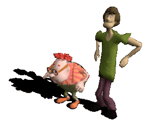
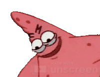

 
# vheyvan

**full-stack builder** | ex-esports | runs communities on the side

---

## what i'm into

code, infrastructure, competitive anything. built communities from scratch. sometimes make videos when i'm not coding. if it has a high skill ceiling, i'm probably interested.

currently open to projects that don't suck.

---

## stack

js, php, laravel, c#, vue/react. know enough about servers and editing to be dangerous.

---

## why did i learn to code?

to escape the esports industry roaming in my career timeline.

---

feel free to check out my repos or hit me up if you've got something worth building. 

also find me on steam 
https://steamcommunity.com/id/Nieuwenhuijzen/
